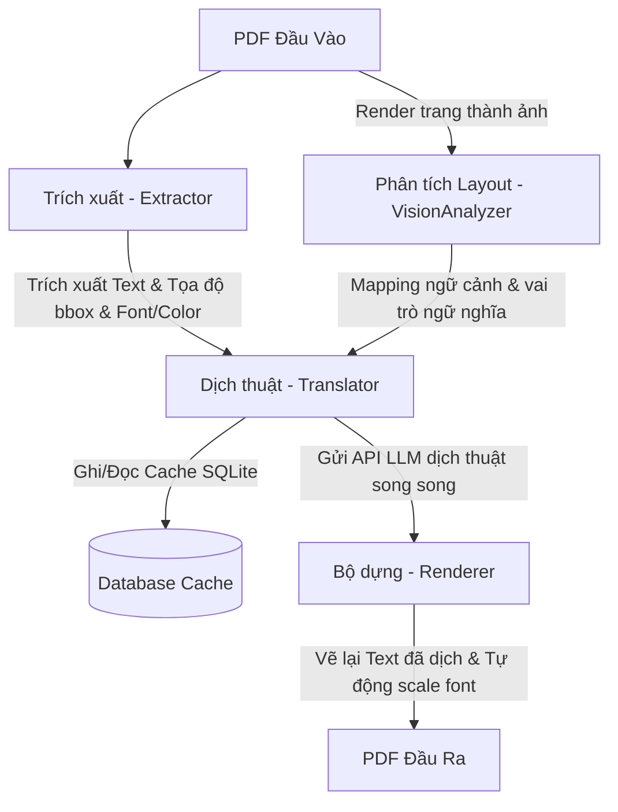

# 📄 pdf-translator

[](https://www.python.org/)
[](https://opensource.org/licenses/AGPL-3.0)
[](https://github.com/astral-sh/uv)

**pdf-translator** là một công cụ dòng lệnh (CLI) mạnh mẽ được thiết kế để dịch thuật tài liệu PDF từ **tiếng Anh sang tiếng Việt** mà vẫn **giữ nguyên bố cục gốc** (layout-preserving). Công cụ sử dụng sức mạnh của các mô hình ngôn ngữ lớn (LLM) thông qua API tương thích OpenAI để dịch văn bản một cách tự nhiên và chính xác nhất.

---

## ✨ Tính năng nổi bật

- **🛡️ Bảo toàn bố cục hoàn hảo:** Giữ nguyên vị trí (bounding boxes), màu sắc chữ, các định dạng cơ bản (chữ đậm, chữ nghiêng) và các thành phần đồ họa khác trong file PDF.
- **⚡ Tự động lưu cache dịch thuật (Local SQLite Cache):** Ghi nhớ các đoạn văn bản đã dịch trước đó để giảm thiểu chi phí gọi API và tăng tốc độ xử lý khi dịch lại tài liệu.
- **👁️ Chế độ Vision-first (Layout Analysis):** Sử dụng các mô hình Vision cục bộ (thông qua Ollama) để phân tích cấu trúc trang (tiêu đề, ghi chú, bảng biểu, chú thích hình ảnh...) trước khi dịch, giúp cải thiện văn phong dịch thuật đúng ngữ cảnh ngữ nghĩa.
- **🔄 Tự động tối ưu kích thước chữ (Auto-Shrink):** Tự động điều chỉnh thu nhỏ cỡ chữ (font size) khi văn bản tiếng Việt dịch ra dài hơn văn bản gốc, tránh việc tràn văn bản hoặc ghi đè lên các phần tử khác.
- **⚡ Dịch song song tốc độ cao:** Tận dụng tối đa lập trình không đồng bộ (`asyncio`) để dịch đồng thời nhiều trang PDF, giúp rút ngắn thời gian xử lý các tài liệu lớn.
- **🌐 Tương thích đa nền tảng LLM:** Hỗ trợ linh hoạt các nhà cung cấp API bao gồm **DeepSeek (Mặc định)**, **OpenAI (GPT-4o)**, **Google Gemini**, hoặc thậm chí các mô hình chạy cục bộ offline qua **Ollama**.
- **🛠️ Cấu hình linh hoạt:** Cho phép thiết lập thông qua file cấu hình TOML, biến môi trường (Environment Variables) hoặc trực tiếp qua đối số dòng lệnh (CLI).
- **📊 Công cụ CLI hiện đại:** Tích hợp thanh tiến trình sinh động (`tqdm`), logging có cấu trúc để gỡ lỗi và chế độ chạy thử nghiệm (`--dry-run`).

---

## ⚙️ Quy trình xử lý (Workflow)



---

## 🚀 Hướng dẫn cài đặt

Dự án sử dụng **[uv](https://github.com/astral-sh/uv)** - một trình quản lý gói Python cực kỳ nhanh chóng.

### Yêu cầu hệ thống:
- **Python 3.11** trở lên.
- **uv** đã được cài đặt trên hệ thống của bạn.
- *(Tùy chọn cho chế độ Vision-first)* **Ollama** và mô hình Vision đã được cài đặt (ví dụ: `qwen3.5:2b`).

### Các bước cài đặt:

1. Clone dự án về máy:
   ```bash
   git clone https://github.com/quocdat22/pdf-translation.git
   cd pdf-translation
   ```

2. Đồng bộ hóa môi trường ảo và cài đặt tất cả các phụ thuộc:
   ```bash
   uv sync
   ```

---

## 📝 Cấu hình hệ thống

Ứng dụng nạp cấu hình theo thứ tự ưu tiên từ cao xuống thấp:
1. **CLI arguments** (Tham số dòng lệnh)
2. **Environment variables** (Biến môi trường)
3. **File config TOML** (`config.toml` tại thư mục gốc)
4. **Giá trị mặc định** (Xem thêm tại [models.py](file:///src/pdf_translator/models.py))

### 1. Sử dụng file cấu hình TOML (`config.toml`)
Sao chép file cấu hình mẫu và chỉnh sửa thông tin API Key của bạn:

```bash
cp config.example.toml config.toml
```

Chỉnh sửa file `config.toml` mới tạo:
```toml
[api]
key = "sk-your-deepseek-api-key"
base_url = "https://api.deepseek.com"
model = "deepseek-chat"

[translation]
source_lang = "English"
target_lang = "Vietnamese"
concurrency = 5  # Số trang xử lý song song
cache = true     # Bật/tắt lưu cache dịch thuật cục bộ (SQLite)

[rendering]
min_font_size = 6.0  # Cỡ chữ tối thiểu khi co giãn
font_path = ""       # Đường dẫn font tùy chỉnh (.ttf), để trống để dùng Noto Sans bundle

[logging]
level = "INFO"       # Cấp độ ghi log: DEBUG | INFO | WARNING | ERROR
log_file = ""        # Đường dẫn file log (để trống = chỉ log ra console)

[vision]
enabled = false                 # Bật/tắt chế độ Vision-first (mặc định: false)
ollama_base_url = "http://localhost:11434" # URL của Ollama local server
ollama_model = "qwen3.5:2b"     # Vision model trên Ollama (phải hỗ trợ image đầu vào)
dpi = 200                       # Độ phân giải ảnh khi render trang để gửi cho Vision AI
timeout = 300                   # Thời gian timeout chờ kết quả từ Vision model (giây)
```

### 2. Sử dụng biến môi trường (Environment Variables)
Nếu không dùng file cấu hình, bạn có thể thiết lập trực tiếp qua môi trường:

**Trên Linux / macOS:**
```bash
export PDF_TRANSLATOR_API_KEY="sk-xxx"
export PDF_TRANSLATOR_MODEL="deepseek-chat"
export PDF_TRANSLATOR_VISION_ENABLED="true" # Bật chế độ Vision
```

**Trên Windows (PowerShell):**
```powershell
$env:PDF_TRANSLATOR_API_KEY="sk-xxx"
$env:PDF_TRANSLATOR_MODEL="deepseek-chat"
$env:PDF_TRANSLATOR_VISION_ENABLED="true"
```

Danh sách đầy đủ các biến môi trường cấu hình:
- `PDF_TRANSLATOR_API_KEY`: API Key của nhà cung cấp LLM
- `PDF_TRANSLATOR_API_BASE_URL`: Endpoint API (mặc định: `https://api.deepseek.com`)
- `PDF_TRANSLATOR_MODEL`: Tên mô hình LLM dùng để dịch thuật
- `PDF_TRANSLATOR_SOURCE_LANG`: Ngôn ngữ nguồn (mặc định: `English`)
- `PDF_TRANSLATOR_TARGET_LANG`: Ngôn ngữ đích (mặc định: `Vietnamese`)
- `PDF_TRANSLATOR_CONCURRENCY`: Số trang xử lý song song tối đa
- `PDF_TRANSLATOR_MIN_FONT_SIZE`: Cỡ chữ tối thiểu khi co giãn font
- `PDF_TRANSLATOR_FONT_PATH`: Đường dẫn font chữ TrueType (.ttf) tùy chỉnh
- `PDF_TRANSLATOR_LOG_LEVEL`: Cấp độ ghi log
- `PDF_TRANSLATOR_LOG_FILE`: Đường dẫn file ghi log
- `PDF_TRANSLATOR_USE_CACHE`: Đặt `false` hoặc `0` để tắt cache dịch thuật
- `PDF_TRANSLATOR_VISION_ENABLED`: Đặt `true` hoặc `1` để bật chế độ Vision-first
- `PDF_TRANSLATOR_VISION_OLLAMA_BASE_URL`: URL của máy chủ Ollama
- `PDF_TRANSLATOR_VISION_OLLAMA_MODEL`: Tên mô hình Vision của Ollama
- `PDF_TRANSLATOR_VISION_DPI`: DPI khi render ảnh để gửi cho Vision model
- `PDF_TRANSLATOR_VISION_TIMEOUT`: Timeout cho Vision model

---

## 💻 Hướng dẫn sử dụng

Dưới đây là một số lệnh phổ biến để chạy công cụ:

```bash
# 1. Dịch cơ bản (Kết quả lưu tại: document_translated.pdf)
uv run pdf-translator document.pdf

# 2. Dịch và lưu ra file kết quả cụ thể
uv run pdf-translator document.pdf -o path/to/result.pdf

# 3. Chỉ dịch một số trang cụ thể (Hỗ trợ trang lẻ hoặc khoảng trang)
uv run pdf-translator document.pdf --pages 1,3,5-8

# 4. Chạy chế độ dùng thử (Dry-run) - Chỉ trích xuất văn bản để kiểm tra, không gọi API dịch
uv run pdf-translator document.pdf --dry-run

# 5. Sử dụng một file cấu hình TOML cụ thể
uv run pdf-translator document.pdf -c custom_config.toml

# 6. Điều chỉnh cấp độ ghi log (DEBUG, INFO, WARNING, ERROR)
uv run pdf-translator document.pdf --log-level DEBUG

# 7. Thay đổi số lượng trang xử lý song song trực tiếp từ CLI
uv run pdf-translator document.pdf --concurrency 10

# 8. Chạy dịch thuật không sử dụng bộ nhớ đệm (Bypass cache database)
uv run pdf-translator document.pdf --no-cache

# 9. Bật chế độ phân tích bố cục Vision-first bằng mô hình AI cục bộ
uv run pdf-translator document.pdf --vision
```

### Chi tiết các tham số CLI:

| Tham số | Phím tắt | Kiểu dữ liệu | Mặc định | Mô tả |
| :--- | :--- | :--- | :--- | :--- |
| `input_file` | — | Đường dẫn | (Bắt buộc) | Đường dẫn file PDF đầu vào cần dịch. |
| `--output` | `-o` | Đường dẫn | `<input>_translated.pdf` | Đường dẫn lưu file PDF đầu ra sau khi dịch. |
| `--config` | `-c` | Đường dẫn | `config.toml` | Đường dẫn tới file cấu hình TOML tùy chỉnh. |
| `--api-key` | — | Chuỗi | `None` | API key dịch thuật (Ghi đè cấu hình trong file và Env Var). |
| `--dry-run` | — | Cờ | `False` | Chỉ trích xuất text, không thực hiện dịch thuật và sinh file. |
| `--log-level`| — | Lựa chọn | `INFO` | Cấp độ ghi log: `DEBUG`, `INFO`, `WARNING`, `ERROR`. |
| `--concurrency`|— | Số nguyên | `5` (hoặc TOML) | Số luồng dịch trang song song tối đa. |
| `--pages` | `-p` | Chuỗi | `None` | Chỉ dịch các trang được chọn (ví dụ: `1,3,5-8`). Mặc định dịch toàn bộ. |
| `--no-cache` | — | Cờ | `False` | Tắt chế độ lưu cache dịch thuật cục bộ. |
| `--vision` | — | Cờ | `False` | Bật chế độ Vision-first (phân tích layout bằng Ollama trước khi dịch). |

---

## 📂 Cấu trúc mã nguồn

```text
pdf-translation/
├── src/
│   └── pdf_translator/
│       ├── __init__.py        # Khởi tạo package và định nghĩa phiên bản
│       ├── __main__.py        # Điểm chạy package (__main__)
│       ├── cli.py             # Điểm khởi chạy CLI và cấu hình đối số dòng lệnh
│       ├── config.py          # Xử lý, nạp và xác thực cấu hình (TOML/Env/CLI)
│       ├── models.py          # Định nghĩa cấu trúc dữ liệu trung tâm (TextBlock, AppConfig...)
│       ├── extractor.py       # Trích xuất văn bản, hình ảnh, tọa độ từ PDF dùng PyMuPDF
│       ├── translator.py      # Gửi dữ liệu tới LLM API để dịch (Asyncio)
│       ├── cache.py           # Lưu trữ và truy vấn bản dịch bằng SQLite cục bộ
│       ├── vision_analyzer.py # Phân tích bố cục trang PDF sử dụng mô hình Vision của Ollama
│       ├── renderer.py        # Vẽ lại văn bản đã dịch lên canvas PDF mới
│       ├── processor.py       # Điều phối toàn bộ vòng đời dịch thuật PDF
│       ├── font_manager.py    # Quản lý fonts chữ hệ thống và tự động co giãn font
│       └── logger.py          # Cấu hình logging
├── tests/                     # Hệ thống kiểm thử tự động (Unit tests & Integration tests)
├── assets/                    # Chứa fonts bổ sung hoặc tài nguyên hệ thống
├── config.example.toml        # File cấu hình mẫu
├── pyproject.toml             # Cấu hình dự án & Phụ thuộc của Python
└── README.md                  # Tài liệu hướng dẫn sử dụng
```

---

## 🧪 Hướng dẫn phát triển & Kiểm thử

Nếu bạn muốn đóng góp cho dự án hoặc chạy kiểm thử:

1. Chạy các bài kiểm thử tự động với `pytest`:
   ```bash
   uv run pytest
   ```

2. Chạy kiểm thử kèm báo cáo độ bao phủ mã nguồn (code coverage):
   ```bash
   uv run pytest --cov=src/pdf_translator tests/
   ```

---

## 📄 Bản quyền (License)

Dự án này được phát hành dưới giấy phép **AGPL-3.0-or-later** (phụ thuộc vào thư viện `PyMuPDF`). Vui lòng tham khảo chi tiết giấy phép để biết thêm thông tin về việc phân phối và sử dụng.
